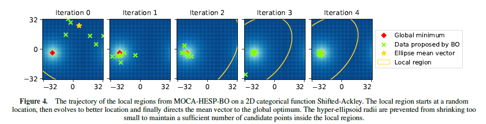

# Overview

Implementation code for paper ***MOCA-HESP: Meta High-dimensional Bayesian Optimization for Combinatorial and Mixed Spaces via Hyper-ellipsoid Partitioning*** published in the *28th European Conference on Artificial Intelligence (ECAI 2025)* The manuscript will be made available soon.



If you find our paper or this repo to be useful for your research, please consider citing:
```
@inproceedings{ngo2025mocahesp,
  title={MOCA-HESP: Meta High-dimensional Bayesian Optimization for Combinatorial and Mixed Spaces via Hyper-ellipsoid Partitioning},
  author={Ngo, Lam and Ha, Huong and Chan, Jeffrey and Zhang, Hongyu},
  booktitle={European Conference on Artificial Intelligence},
  year={2025}
}
```

# Requirement and dependencies
- Install Anaconda/Miniconda.
- Install env from ```mocahesp.yml``` file by running the following line via conda:
```
conda env create -f mocahesp.yml
```
- (Optional) If you want to run antibody benchmark, run the following line:
```
bash install-antibody-lib.sh
```
- (Optional) If you want to run Cellular Network Optimization becnhmark: download all files in ```power_maps``` folder at https://github.com/Ryandry1st/CCO-in-ORAN/tree/main/cco_standalone_icassp_2021/data/power_maps to _benchmark_problems/cco/powermaps


# Getting started
The main file is ```test-mocahesp.py```. To run ```MOCA-HESP-BO``` for the non-shifted ```Ackley20c``` problem, use the following syntax:
```
python test-mocahesp.py --solver bo -f ackley20c -n 400 --seed 1
```

Please see the following table for all arguments, as well as their possible values.

| Flag &nbsp; &nbsp; &nbsp; &nbsp; &nbsp; &nbsp; &nbsp; &nbsp; &nbsp; &nbsp; &nbsp;| Description |
| --- | --- | 
| -f | A *string* specifying objective function's name. Possible options include categorical problems (```ackley20c```, ```maxsat28```, ```maxsat125```, ```labs```, ```antibody```) and mixed problems (```ackley53m```, ```cco```, ```svm```). To add more benchmark problems, follow the templates in ```mocahesp/function_wrapper.py```. |
| -n | An *integer* specifying the iteration budget. |
| --solver | (Optional) A *string* specifying the BO solver to be integrated. Possible values include ```bo```, ```casmo``` and ```bounce```. Default is ```bo``` |
| --shifted | (Optional) A *flag* specifying whether to use the shifted version of benchmark problem. If not set, the original benchmark problems are used. Default is original problem. |
| --n_init | (Optional) An *integer* specifying the number of initialization. Recommend to be higher than the maximum number of choices across all categorical/ordinal variables. Default is ```20```. |
| --seed | (Optional) An integer to specify the random seed for random number generator. Default is ```1```. |

# Results from paper
To produce the main experimental results in the paper (Fig. 2), run the bash file ```experiments-from-paper.sh```.

# Acknowledgements

This code implementation uses materials from the following public repositories to implemenent the subspace embedding. We thank the respective repository maintainers.
1. CMA-ES: Hansen, N., & Ostermeier, A. (2001). Completely derandomized self-adaptation in evolution strategies. Evolutionary computation, 9(2), 159-195.
   Code repo: https://github.com/CMA-ES/pycma
2. CASMOPOLITAN: Wan, Xingchen, et al. "Think Global and Act Local: Bayesian Optimisation over High-Dimensional Categorical and Mixed Search Spaces." International Conference on Machine Learning. PMLR, 2021..
   Code repo: https://github.com/xingchenwan/Casmopolitan
3. Bounce: Papenmeier, Leonard, Luigi Nardi, and Matthias Poloczek. "Bounce: Reliable high-dimensional Bayesian optimization for combinatorial and mixed spaces." Advances in Neural Information Processing Systems 36 (2023): 1764-1793.
   Code repo: https://github.com/LeoIV/bounce
